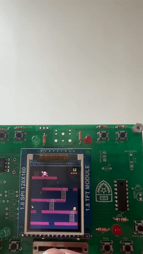
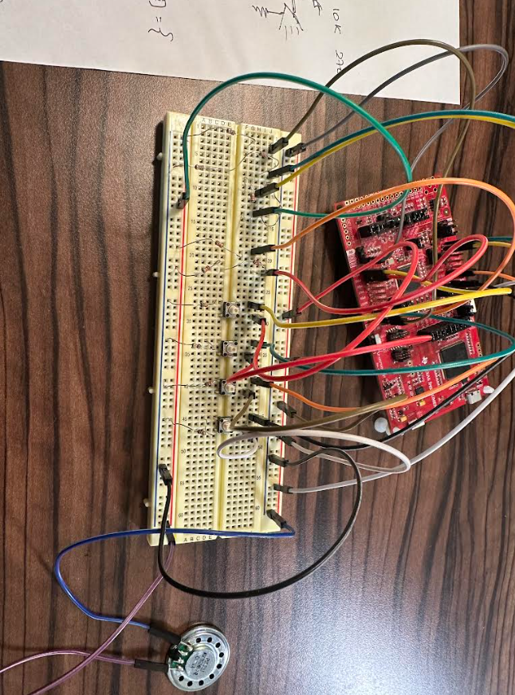

# Donkey Kong Handheld

> TI MSPM0G3507 · bare-metal C · custom PCB · ST7735 TFT · interrupt-driven FSMs

A playable Donkey Kong clone running bare-metal at 80 MHz on a **custom PCB** — ECE 319K final project at UT Austin, built with Pranav Shivashankar.

## Features

- Five-level platform stage with ladders, fall-through gaps, and an instant-death pit
- Up to **10 barrels rolling simultaneously**, each following one of four pre-computed paths chosen at random on spawn
- Table-driven jump arc — height/timing tunable without touching physics code
- Collectible bananas spawning at random locations on a timer
- 3 lives, score, pause, animated game-over screen
- **Bilingual UI** (English/Spanish) selected via slide potentiometer
- DAC sound effects on jump, coin pickup, and death

## Architecture

Two hardware timers drive the game independently of the render loop:

| Timer | Rate | Job |
|---|---|---|
| TIMG12 | 30 Hz | game engine tick — animation, score, banana timer, barrel spawning |
| TIMG0 | 30 Hz | barrel path stepping |

Both ISRs bail out immediately when the pause flag is set. **All SPI display output happens in main; ISRs only mutate state** — keeping SPI traffic out of interrupt context. Rendering is dirty-rect based: sprites erase and redraw only when their coordinates change, which keeps the frame rate up over a slow SPI display.

## Hardware

Custom PCB: MSPM0G3507, 128×160 ST7735 TFT, pushbuttons (jump / climb up / climb down / pause), slide potentiometer via ADC for movement and menu selection, binary-weighted DAC for audio out to a speaker.

Prototyped on breadboard first:

## Repo notes

`src/` contains our game code (main loop, sprite/collision engine, barrel path tables, image assets). Course-provided drivers (`ST7735.h`, `Clock.h`, etc.) are not redistributed here.

---
*Braden Feuer & Pranav Shivashankar · ECE 319K, UT Austin · [bradenfeuer.github.io](https://bradenfeuer.github.io)*
